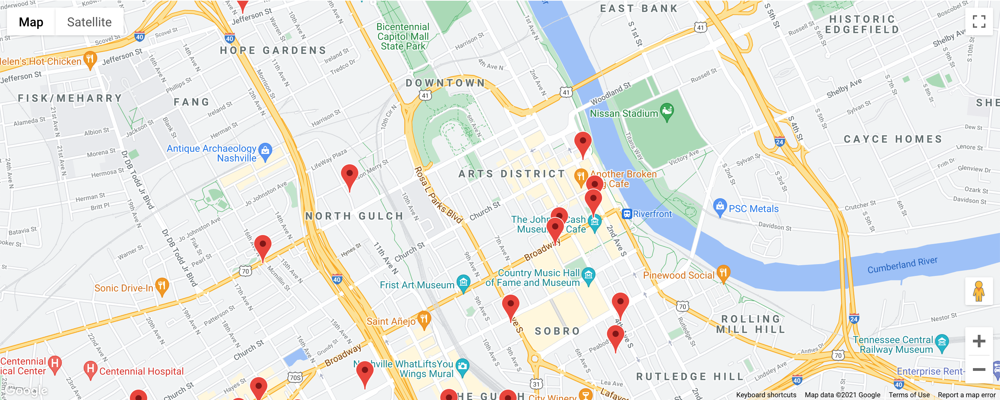
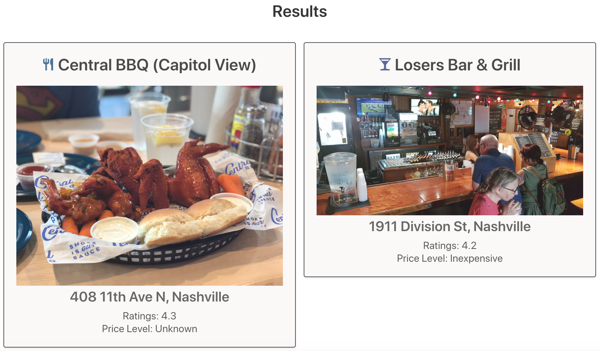

# EasyLink

This app is to connect people with locations. Users can search the app to find locations that match with their taste in food and drinks. Wheather you are new to town or need a new place to check out, this app will give the user the ability to find what fits their taste.


## For the user who would like to:
- Find new restaurants and bars in their area
- Looking for good local bars and restaurants as a travelor or new to an area
- See all the options in their area that they might not have known about


## How it works:
1. Click **get started**
2. Enter name, and email address. Then select age, cuisine type and bar option from the dropdown.
3. Click **Save changes** then click **Close** to get the results
4. Map provides the pins of restaurants and bars based on the user choice
5. 1 or 2 cards appear based on the user choice on the **Results** section
6. Each card provides the name, a photo, the address, its rating, and price level of the restaurant or the bar
7. The user can contact the developer for any feedback through **Contact Us** section


## Features:
1. Google Map API & Place API was used
### Example:
```javascript
map = new google.maps.Map(document.getElementById("map"), {
    center: { lat: 36.1627, lng: -86.7816 },
    zoom: 15,
	mapId: "4e61ecbe9e376a4a"
  });
```
```javascript
service = new google.maps.places.PlacesService(map);
```

2.  When the user clicks the pin on the map, it gives an info window with details including the name and the address of the place

### Before:


### After:


### Example:
```javascript
google.maps.event.addListener(marker, 'click', (e) => {
    var placeDetail = "<b>" + place.name + "</b> <br/>" + place.vicinity;
    infowindow.setContent(placeDetail);
    infowindow.setPosition(e.latLng);
    infowindow.open(map);
});
```


3. Card(s) will appear on the results section with the details of the restaurant or the bar
### Example:



## Deployed URL
https://suekimpaulsen.github.io/Group-project-1/
